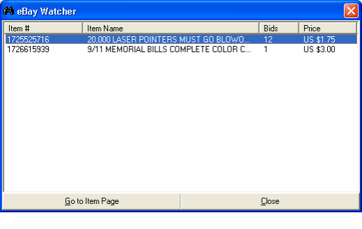



## eBay Watcher

### Description

eBay Watcher will periodically check for updates to eBay Auctions. The user specifies the eBay auction IDs and can view the status of the auctions at any time. When the bid price changes, a popup boxes notifies the user of the auction name, the number of bids, and the current price.
 
### More Info
 

             |
---                |---
**Submitted On**   |2002-05-02 19:43:58
**By**             |[Sean Ferguson](https://github.com/Planet-Source-Code/PSCIndex/blob/master/ByAuthor/sean-ferguson.md)
**Level**          |Intermediate
**User Rating**    |3.0 (15 globes from 5 users)
**Compatibility**  |VB 5\.0, VB 6\.0
**Category**       |[Complete Applications](https://github.com/Planet-Source-Code/PSCIndex/blob/master/ByCategory/complete-applications__1-27.md)
**World**          |[Visual Basic](https://github.com/Planet-Source-Code/PSCIndex/blob/master/ByWorld/visual-basic.md)
**Archive File**   |[eBay\_Watch78703522002\.zip](https://github.com/Planet-Source-Code/sean-ferguson-ebay-watcher__1-34376/archive/master.zip)

